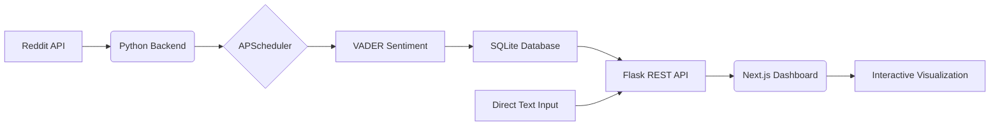

# RedditAlytics — Sentiment Analysis Dashboard 🚀

RedditAlytics is an end-to-end data analysis platform designed to track, clean, and visualize public opinion across various subreddits. It combines a robust Python-based NLP pipeline with a modern Next.js dashboard to provide deep insights into the emotional pulse of online communities.

---

## 🏗 System Architecture



---

## 🌟 Key Features

*   **Multivariate Sentiment Analysis**: Track Positive, Neutral, and Negative skews using the VADER model.
*   **Emotion Radar**: Visualize Joy, Anger, Fear, Sadness, and Surprise across different communities.
*   **Temporal Trend Tracking**: See how public opinion shifts day-by-day.
*   **Live Text Analyzer**: Paste any block of text or comment thread for instant segment-based analysis.
*   **Subreddit Comparison**: Benchmark different communities against each other for toxicity or positivity.
*   **Data Persistence**: Real-time storage in SQLite for historical benchmarking and analysis.

---

## 🛠 Tech Stack

*   **Frontend**: Next.js 14, React, TypeScript, Tailwind CSS, Recharts, Lucide Icons.
*   **Backend**: Python 3.8+, Flask, Pandas, NLTK (VADER), Flask-CORS.

---

## 🚀 Quick Start (Running the Project)

### 1. Prerequisite
Ensure you have **Python 3.8+** and **Node.js 18+** installed.

### 2. Run the Backend
```bash
cd backend
pip install -r requirements.txt
python app.py        # Start the API server & Background Sync (Port 5000)
```

### 3. Run the Frontend
```bash
cd frontend
npm install
npm run dev          # Start the dashboard (Port 3000)
```

### 4. Open the Dashboard
Navigate to [http://localhost:3000](http://localhost:3000) in your browser.

---

## 📂 Project Structure

*   **/backend**: The NLP brain of the project. Contains analysis scripts and the Flask server.
*   **/frontend**: The visualization layer. Contains the React application and UI components.
*   **/data**: (Inside backend) CSV datasets used for training and testing.
